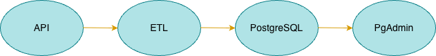
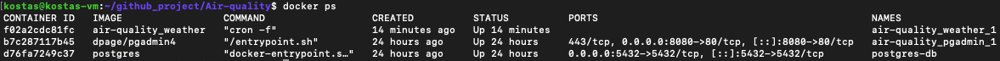
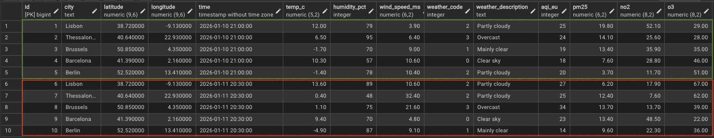

# 🌦️ Weather & Air Quality ETL Pipeline

## 📌 Overview

This project implements an **end-to-end ETL (Extract – Transform – Load) pipeline** that collects **current weather and air quality data** for selected European cities using the **Open-Meteo API**, processes the data, and stores it in a **PostgreSQL database**.

The pipeline is fully **containerized with Docker** and scheduled to run **automatically every month** using **cron**.

---

## 🧱 Architecture

**High-level data flow:**
Open-Meteo APIs
↓
Extract (Python)
↓
Transform (Pandas)
↓
Load (PostgreSQL)
↓
pgAdmin (Visualization)

**Infrastructure overview:**

- A **Linux Virtual Machine** hosts all services
- **Docker Compose** orchestrates:
  - PostgreSQL (database)
  - pgAdmin (database UI)
  - Python ETL service (with cron scheduling)

---

## 🧪 Development Workflow

The project was developed in **two distinct phases**.

### 1️⃣ Prototyping & Validation (Jupyter Notebooks)

Initially, the ETL logic was designed and tested using **Jupyter notebooks**:

- `extract.ipynb` – API calls and raw data extraction
- `transform.ipynb` – data cleaning, column selection, weather code mapping
- `load.ipynb` – database schema design and initial loading logic

This phase allowed:

- rapid experimentation
- inspection of intermediate data
- validation of transformations before production

---

### 2️⃣ Productionization (Python Script)

After validation, the logic was consolidated into a single production-ready script:

- `load.py`

This script:

- performs **extract, transform and load** in one execution
- includes retry logic and timeouts for external API calls
- connects to PostgreSQL using SQLAlchemy
- is executed automatically by **cron inside a Docker container**

---

## ⚙️ Technologies Used

- Python 3.9
- Pandas / NumPy
- Requests
- SQLAlchemy & psycopg2
- PostgreSQL
- pgAdmin
- Docker & Docker Compose
- Cron
- Linux Virtual Machine

---

## 🗄️ Database Schema

Table: `weather_data`

| Column              | Description                        |
| ------------------- | ---------------------------------- |
| city                | City name                          |
| latitude            | Latitude                           |
| longitude           | Longitude                          |
| time                | Observation timestamp              |
| temp_c              | Temperature (°C)                   |
| humidity_pct        | Relative humidity (%)              |
| wind_speed_ms       | Wind speed                         |
| weather_code        | Numeric weather code               |
| weather_description | Human-readable weather description |
| aqi_eu              | European AQI                       |
| pm25                | PM2.5 concentration                |
| no2                 | Nitrogen dioxide                   |
| o3                  | Ozone                              |

The table is created automatically if it does not already exist.

---

## ⏱️ Scheduling

The ETL job is scheduled using **cron** inside the Python container:
0 0 1 \* \*

➡️ The pipeline runs **once per month**, on the **1st day of the month at 00:00**.

For testing and development purposes, the schedule can be temporarily modified  
(e.g. to run every 5 minutes using `*/5 * * * *`) in order to validate the pipeline execution and logging.

---

## 🐳 Docker Setup

Services managed via `docker-compose.yaml`:

- **postgres-db** → PostgreSQL database
- **pgadmin** → Web-based database management tool
- **weather** → Python ETL container with cron

All services run on the same Docker network, enabling internal hostname resolution.

---

## 📊 Data Access

Data can be accessed in two ways:

- Direct SQL queries on PostgreSQL
- Visual inspection using **pgAdmin**

Example query:

```sql
SELECT *
FROM weather_data
ORDER BY time DESC, city;

```

🚀 Key Features

Fully automated ETL pipeline

Containerized and reproducible environment

Separation of experimentation (notebooks) and production code

Scheduled execution with cron

Persistent database storage

Clean and extensible architecture

## 📸 Screenshots

The following screenshots are recommended to visually document the project and its execution:

-**Architecture Diagram**  
 High-level overview of the ETL pipeline, showing the data flow from the Open-Meteo APIs through the Python ETL service into PostgreSQL, with Docker and the VM as the underlying infrastructure.


- **Docker Containers Running**  
  Output of `docker ps`, demonstrating that all services (PostgreSQL, pgAdmin, and the ETL container) are up and running.
  

- **pgAdmin – weather_data Table**  
   View of the `weather_data` table in pgAdmin, displaying ingested weather and air quality records when cron run.
  

📬 Contact

linkedin: https://www.linkedin.com/in/konstantinosroulias/
GitHub: https://github.com/KostasRoulias
